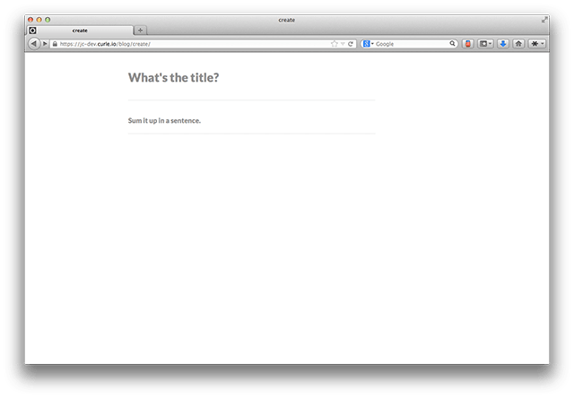
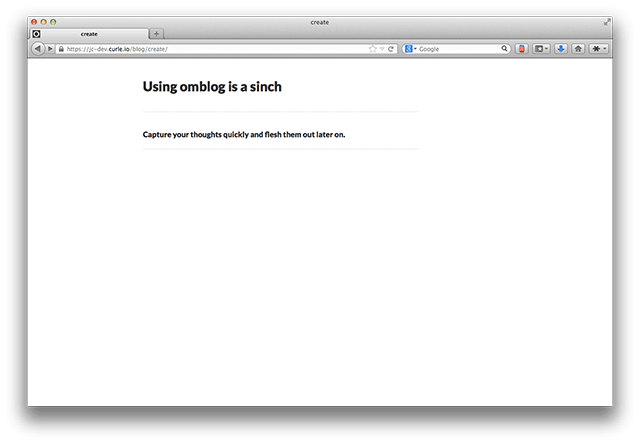
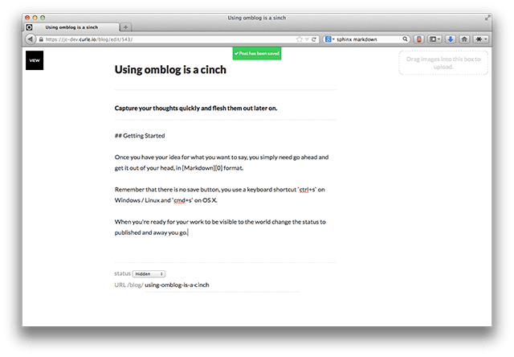

.. raw:: html

    
    

Installation
=================================

install omblog  via pip:

.. code-block:: bash

   $ pip install django-omblog

Once downloaded add omblog into ``settings.INSTALLED_APPS``::

    settings.INSTALLED_APPS = (
        # other apps here ...
        'omblog',
    )

Next wire up the ``omblog.urls`` to your ``urls.py``::

    urlpatterns += ('',
        # other urls here
        (r'^blog/', include('omblog.urls', namespace='omblog')),
    )

Next do a syncdb and collectstatic:

.. code-block:: bash

    $ python manage.py syncdb
    $ python manage.py collectstatic

Writing Posts
==========================================

Now you're ready to start posting. Head over to ``/blog/create`` and you'll be asked to 
login if you're not authenticated.  If you need to create a user account you can do
that via the standard ways that django provides. When you hit the create page you'll
see this page.

The workflow in omblog is as based around the idea of capturing an idea and fleshing it 
out later on. You always begin with entering a title and a description. Omblog uses keyboard
shortcuts to save so you don't have to bother with pressing
buttons. ``ctrl+s`` will save on Windows, Linux and OS X, but as a bonus (and keeping in
line with the rest of the OS X) you can also use ``cmd + s`` to save in OS X.

When you save (``ctrl+s``/ ``cmd + s``) you'll be taken to the page where you can flesh it out.

Configuration
==========================================

``OMBLOG_RSS_TITLE`` – ``string`` containing the title of the RSS feed.

``OMBLOG_RSS_LINK`` – ``string`` containing the base URL of the blog.

``OMBLOG_CACHE_ENABLED`` – ``Boolean`` that if enabled and the middleware is installed
then static caching will take place. Defaults to ``True``.

``OMBLOG_SHOW_HIDDEN_IF_LOGGED_IN`` –  ``Boolean`` that if enabled then posts marked as hidden will be
show when you're logged in. Defaults to ``True``.

``OMBLOG_INDEX_ITEMS`` –  ``Integer`` that represents the number of items to show in the
index. Defaults to ``20``

License
====================

omblog is released under a `BSD 3 clause license`_

.. include:: <isonum.txt>

Copyright |copy|  2014, Obscure Metaphor LTD.
All rights reserved.

Redistribution and use in source and binary forms, with or without 
modification, are permitted provided that the following conditions are met:

- Redistributions of source code must retain the above copyright notice, this list of conditions and the following disclaimer.

- Redistributions in binary form must reproduce the above copyright notice, this list of conditions and the following disclaimer in the documentation and/or other materials provided with the distribution.

- Neither the name of the Obsure Metaphor LTD nor the names of its contributors may be used to endorse or promote products derived from this software without specific prior written permission.

THIS SOFTWARE IS PROVIDED BY THE COPYRIGHT HOLDERS AND CONTRIBUTORS "AS IS"
AND ANY EXPRESS OR IMPLIED WARRANTIES, INCLUDING, BUT NOT LIMITED TO, THE
IMPLIED WARRANTIES OF MERCHANTABILITY AND FITNESS FOR A PARTICULAR PURPOSE
ARE DISCLAIMED. IN NO EVENT SHALL THE COPYRIGHT HOLDER OR CONTRIBUTORS BE
LIABLE FOR ANY DIRECT, INDIRECT, INCIDENTAL, SPECIAL, EXEMPLARY, OR
CONSEQUENTIAL DAMAGES (INCLUDING, BUT NOT LIMITED TO, PROCUREMENT OF
SUBSTITUTE GOODS OR SERVICES; LOSS OF USE, DATA, OR PROFITS; OR BUSINESS
INTERRUPTION) HOWEVER CAUSED AND ON ANY THEORY OF LIABILITY, WHETHER IN
CONTRACT, STRICT LIABILITY, OR TORT (INCLUDING NEGLIGENCE OR OTHERWISE)
ARISING IN ANY WAY OUT OF THE USE OF THIS SOFTWARE, EVEN IF ADVISED OF THE
POSSIBILITY OF SUCH DAMAGE.

.. _BSD 3 clause license: http://www.opensource.org/licenses/bsd-3-clause
